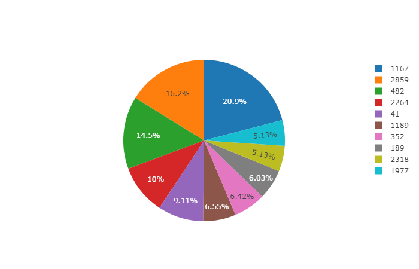
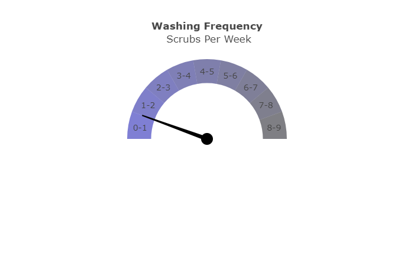
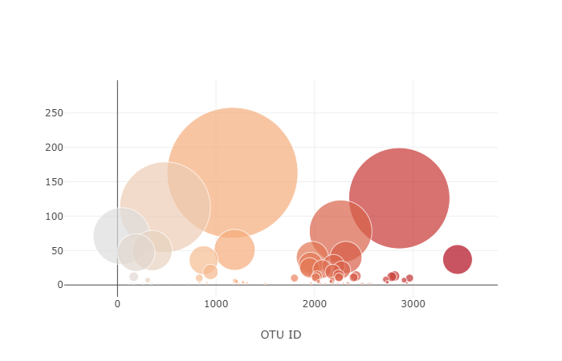

# Plotly Challenge - Belly Button Biodiversity

The purpose of this project is to build an interactive dashboard to explore the [Belly Button Biodiversity DataSet](http://robdunnlab.com/projects/belly-button-biodiversity/). The data contains "the relative abundance of different microbial “species” (technically operational taxonomic units, OTUs) across all the belly buttons sampled." 

The project incorporates flask, flask-sqlalchemy, and plotly to develop a tool that can be deployed to Heroku (https://dashboard.heroku.com/apps/bellybuttoncmh)

## Example Visualizations

## Pie chart showing the top 10 OTU for sample

## Gauage showing the frequency of washing per week for sample

## Bubble chart showing amount by OTU

